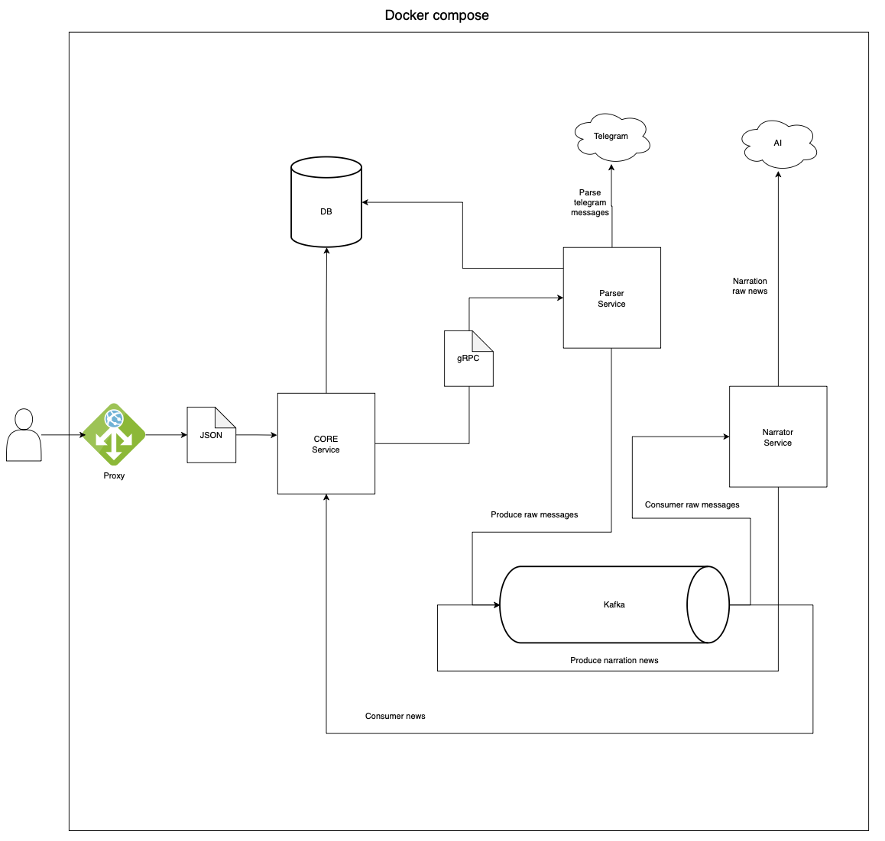

# SumTel

> ⚠️ **Project Status: Work in Progress**
>
> This project is currently under active development. Features, architecture, and API contracts are subject to change.

## Overview

SumTel is a microservices-based platform designed to parse Telegram channels and generate concise, AI-powered summaries of their content. The service aggregates raw messages from various channels and uses Artificial Intelligence to create digestible news feeds, allowing users to stay updated without reading through high-volume message streams.

## Technologies

The project utilizes a modern, scalable technology stack:

- **Programming Language:** Go (Golang)
- **Communication:**
  - **gRPC:** For efficient inter-service communication.
  - **REST API:** For client-facing interactions.
- **Messaging:** Apache Kafka (for asynchronous event-driven architecture).
- **Database:** PostgreSQL.
- **Infrastructure:** Docker & Docker Compose.
- **AI Integration:** LLM-based processing for text summarization.

## Architecture

The system is divided into several specialized microservices:

- **Core Service (`services/core`):** The central hub responsible for user management, channel subscriptions, and serving the main API.
- **Parser Service (`services/parser`):** Connects to Telegram to fetch and process raw messages from channels.
- **Narrator Service (`services/narrator`):** The AI-driven component that consumes raw messages and generates human-readable summaries.
- **Migrator (`services/migrator`):** Handles database schema migrations and versioning.

### Visualization of service operation

<div align="center">
    
</div>

## Getting Started

### Prerequisites

- Docker & Docker Compose
- Go 1.22+ (for local development)
- Make

### Running the Project

You can start the entire infrastructure using the provided Makefile:

```bash
make up
```

This command will:
1. Build and start all services via Docker Compose.
2. Initialize the necessary Kafka topics (`raw-messages`, `news-aggregated`).
3. Set up the database.

To stop the services:

```bash
make down
```

## TODO

The following tasks are planned for future development:

- [ ] **Testing:** Increase unit test coverage and implement integration tests.
- [ ] **CI/CD:** Set up automated build and deployment pipelines (e.g., GitHub Actions).
- [ ] **Observability:** Add metrics (Prometheus), dashboards (Grafana), and distributed tracing (Jaeger/OpenTelemetry).
- [ ] **API Documentation:** Generate Swagger/OpenAPI documentation for the REST API.
- [ ] **AI Enhancements:** Improve prompt engineering for better summaries and support additional LLM providers.
- [ ] **Parser Improvements:** Add error handling strategies and support for media parsing (images/videos).
- [ ] **Security:** Enhance authentication mechanisms and implement Role-Based Access Control (RBAC).

